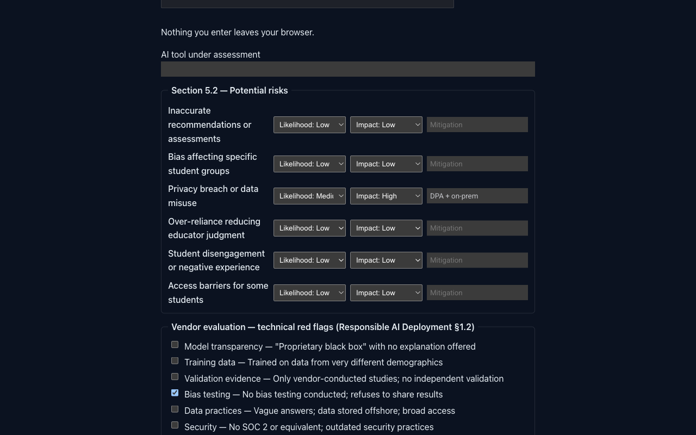

# AI-Ethics-Education-Framework: an ethics framework for AI in education, published as a site, with the impact-assessment template's risk section turned into a worksheet that produces a recommendation

[](https://github.com/Freddricklogan/AI-Ethics-Education-Framework/actions/workflows/deploy.yml)
[](#5-getting-started--verification)
[](https://github.com/Freddricklogan/AI-Ethics-Education-Framework/actions/workflows/codeql.yml)
[](LICENSE)
[](https://freddricklogan.github.io/AI-Ethics-Education-Framework/)

## 1. Executive Summary & Business Impact

**Problem statement.** Institutions adopting AI tools need ethical
principles, a way to assess bias, deployment guidelines, an
AI-literacy curriculum and an impact assessment to complete before a
tool touches students. This repository held all five as Markdown,
readable on GitHub and nowhere else. Its impact-assessment template
asked a committee to rate six risks for likelihood and impact and
then pick one of five recommendations — without saying how the
ratings should lead to the recommendation.

**What this delivers.** The framework as a navigable site, and the
template's risk section as a worksheet: six risks rated High / Medium
/ Low on two axes with a mitigation each, fourteen vendor red flags
from the deployment guidelines, and one of the template's five
recommendations with the reasons listed. The rating matrix and the
recommendation ladder are stated on the page as the worksheet's
convention, because the framework does not supply them, and they are
pinned by tests so a committee can change them deliberately.

**Who it is for.** AI governance committees, district and campus
technology leaders, privacy officers, and the educators who bring a
tool to them for approval.

**[→ Read the full case study](docs/CASE_STUDY.md)**

## 2. Demonstrated Competencies & Technical Skills

| Area | What the repository shows |
| --- | --- |
| AI governance | Principles, bias assessment, deployment lifecycle, incident categories, discontinuation criteria — written for decision makers |
| Instrument design | A template's open-ended section made decidable, with the added conventions separated from the source text and stated where the user reads them |
| Static publishing | MkDocs + Material, `strict` build so a broken cross-reference fails CI |
| Front-end discipline | ES modules, no inline handlers, no `innerHTML`; pure logic separated from DOM code and tested at 100% statements |
| CI/CD | Lint → tests → strict site build → npm audit + Trivy → Pages deploy; CodeQL on a schedule |

## 3. System Architecture & Data Flow

```
docs/*.md ─────────────────┐
docs/tools/risk-worksheet.md ┤  mkdocs build --strict  ──►  site/  ──►  GitHub Pages
docs/assets/               │
  ├─ lib/risk.js  ◄────────┼── tests/risk.test.js (Vitest, 100% statements)
  ├─ risk-page.js          │   builds the form, calls assess(), renders recommendation + Markdown
  ├─ site.js               │   mounts the Executive Shell on every page
  └─ shell/                │   exec-shell.js / .css (vendored)
```

Every page is static. The worksheet runs entirely in the browser;
nothing is sent anywhere. No CSP `<meta>` is set because Material
relies on inline scripts; the tool's own code has no inline handlers
or styles.

## 4. Technical Highlights & Engineering Decisions

- **The framework's text is kept separate from the worksheet's
  rules.** `RISKS`, `LEVELS`, `RED_FLAGS` and `RECOMMENDATIONS` in
  `docs/assets/lib/risk.js` are transcribed from the documents. The
  3×3 matrix (`rate`) and the ladder in `assess` are the worksheet's,
  and the page says so before the form.
- **Defer is the default.** Any unrated risk yields the template's
  "Defer — insufficient information"; the worksheet never shows
  "Approve" on a half-finished form.
- **A mitigation has to be written to count.** Whitespace is not a
  mitigation; a Critical risk without one is a Deny, with one it is a
  Pilot.
- **Red flags add conditions, not vetoes.** The deployment guidelines
  call them questions to ask a vendor, so the worksheet lists them
  as conditions on an approval rather than grounds for denial.
- **Kit reuse.** Site scaffold, workflows and shell are the shared
  MkDocs kit used by EdTech-Policy-Framework; only the tool module and
  its page are specific to this repository.

## 5. Getting Started & Verification

**Prerequisites.** Node 22, Python 3.12 and `uv`.

```bash
git clone https://github.com/Freddricklogan/AI-Ethics-Education-Framework.git
cd AI-Ethics-Education-Framework
npm ci && uv venv && uv pip install -r requirements.txt
npm run check            # eslint, vitest --coverage, mkdocs build --strict
uv run mkdocs serve      # http://127.0.0.1:8000/AI-Ethics-Education-Framework/
```

**Verification — the numbers this repository actually produced:**

| Check | Result |
| --- | --- |
| Tests (Vitest) | **7 passed / 7** |
| Coverage | **100%** statements, 93.15% branches over `docs/assets/lib/risk.js` |
| ESLint | clean |
| `mkdocs build --strict` | 0 warnings, 8 pages |
| Worksheet | 6 risks × 2 ratings, 14 red flags (9 technical, 5 pedagogical), 5 recommendations |
| Site smoke (headless Chrome) | **0 console errors / 0 warnings**; 12 selects, 14 checkboxes; recommendation moves Defer → Approve → Deny → Pilot required → Approve with conditions as ratings, a mitigation and a red flag are entered; tour step 1 of 2 opens; no horizontal scroll at 1280 or 400 px |

## 6. Live Demo & Production Showcase

**<https://freddricklogan.github.io/AI-Ethics-Education-Framework/>** —
the framework and the worksheet at **Tools → Risk worksheet**.

**30-second guided walkthrough.** Press **Take the 30-second tour** in
the header: the five documents, then the worksheet where rating the
six risks produces a recommendation and a Markdown record for the
assessment.



**Related.** EdTech-Policy-Framework (technology-evaluation rubric
scorer) and Public-Service-Digital-Transformation (maturity
calculator) use the same site kit.

---

## License

MIT — see [LICENSE](LICENSE).
